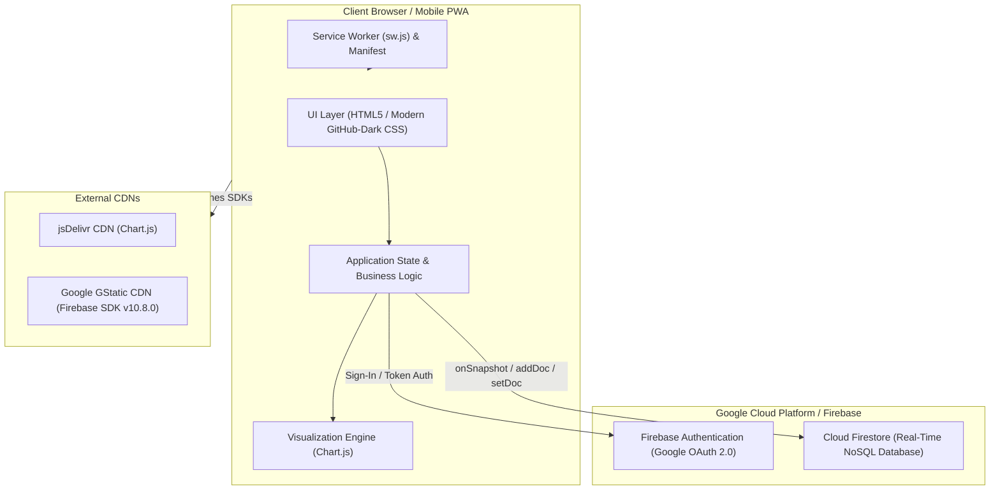
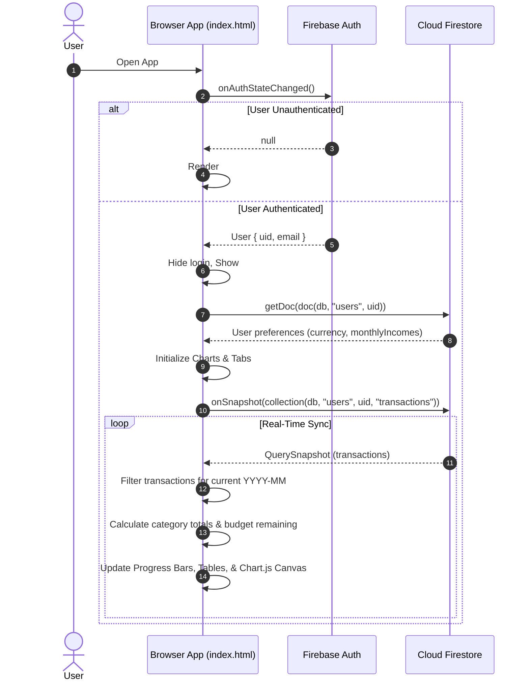
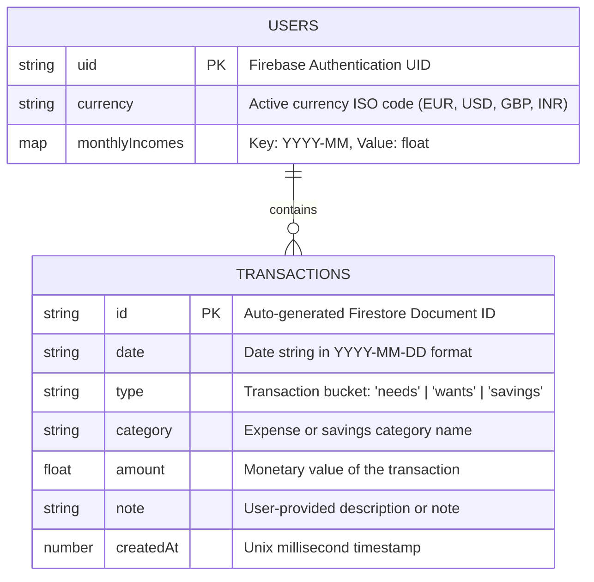
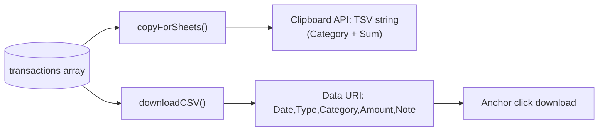

# Architecture Documentation: 50/30/20 Budget Tracker

## 1. Executive Summary

The **50/30/20 Budget Tracker** is a client-side Progressive Web Application (PWA) designed to facilitate personal financial budgeting through the well-known **50/30/20 financial framework** (50% Needs, 30% Wants, 20% Savings). 

Originally conceived as a browser-local tool, the application has evolved into a cloud-synchronized, multi-device web application backed by **Google Firebase** (Authentication and Cloud Firestore). It presents a GitHub-inspired dark interface with real-time responsive analytics powered by **Chart.js**, enabling mobile and desktop users to manage incomes, log categorized expenditures, monitor real-time category thresholds, and export records for spreadsheet processing.

---

## 2. High-Level System Context

The application operates as a Single-Page Application (SPA) delivered via static web hosting (GitHub Pages) with serverless backend integrations for identity and persistence.



---

## 3. Technology Stack & Runtime

| Layer | Technology | Details |
| :--- | :--- | :--- |
| **Hosting & Delivery** | GitHub Pages / Static Hosting | Served over HTTPS directly from repository root |
| **App Shell** | Single-Page Application (SPA) | Pure HTML5, CSS3, ES6+ JavaScript in [`index.html`](file:///D:/budget%20app/Budget-appliction/Budget-appliction/index.html) |
| **Styling & Design System** | Custom CSS Variables | GitHub Dark Theme (`--color-canvas-default: #0d1117`, `--color-accent-fg: #2f81f7`, etc.) with glassmorphism backdrops |
| **Visualizations** | Chart.js v4+ (via jsDelivr CDN) | Donut and Pie charts for overall spending and category limit tracking |
| **Authentication** | Firebase Authentication v10.8.0 | Google OAuth Popup (`GoogleAuthProvider`, `signInWithPopup`) |
| **Data Persistence** | Cloud Firestore v10.8.0 | Document & subcollection real-time listeners (`onSnapshot`) |
| **Mobile Scaffolding** | PWA (Web App Manifest + Service Worker) | Fullscreen standalone display, mobile viewport optimizations (`manifest.json`, `sw.js`) |
| **Localization & Formatting** | `Intl.NumberFormat` API | Dynamic multi-currency formatting (`EUR`, `USD`, `GBP`, `INR`) |

---

## 4. Repository & File Inventory

```
Budget-appliction/
├── .git/                     # Git version control metadata
├── index.html                # Monolithic SPA entrypoint (HTML, CSS, logic, Firebase module)
├── manifest.json             # Web App Manifest defining PWA metadata, theme, and icons
├── sw.js                     # Service Worker script enabling browser PWA installability
├── README.md                 # Public documentation and GitHub badge links
├── icon-192.png              # App icon (192x192) for mobile home screens
├── icon-512.png              # High-resolution app icon (512x512) for splash screens
├── image_c221eb.png          # App background imagery integrated into desktop/tablet layout
└── GEMINI.md                 # System architecture documentation (this document)
```

---

## 5. Architectural Components & Frontend Lifecycle

The frontend application code in [`index.html`](file:///D:/budget%20app/Budget-appliction/Budget-appliction/index.html) is composed of three interconnected sub-layers:

### 5.1 Presentation & UI Layer
- **Auth Gate (`#login-screen`)**: Displayed when no authenticated Firebase user session exists.
- **Application Shell (`#app-container`)**: Displayed upon successful user authentication. Includes:
  - Global Header with contextual title and "Sign Out" control.
  - Tab Navigation Bar (`.UnderlineNav`) supporting tab switching:
    - **Overview**: 50/30/20 summary distribution chart, currency selector, monthly net income registration, and target cards.
    - **Needs (50%)**: Expense logging form, date-sorted transaction log, spending progress bar, and sub-limit doughnut gauges for *Groceries* and *Miscellaneous*.
    - **Wants (30%)**: Expense logging form, transaction log, spending progress bar, and sub-limit doughnut gauges for *Clothing* and *Eating Out*.
    - **Savings (20%)**: Savings allocation logging form, progress bar towards the 20% target, and allocation history log.
    - **Data & Export**: Frictionless data interoperability actions.

### 5.2 Application State & Controller
The script uses an event-driven, reactive pattern anchored around user authentication state:



### 5.3 Chart Visualization Engine
Integrated via Chart.js canvas elements:
- **`overviewChart`** (`type: 'pie'`): Renders proportional breakdown of logged Needs, Savings, Wants, alongside unspent Remaining income.
- **`groceriesDonut`**, **`miscellaneousDonut`**, **`clothingDonut`**, **`eatingOutDonut`** (`type: 'doughnut'`): Act as radial gauges measuring expenditure against preset budget limits. Dynamically switches fill palette from accent blue/purple to danger red (`#f85149`) when limits are breached.

---

## 6. Data Architecture & Firestore Schema

All persistent application state is stored within Cloud Firestore organized under a per-user hierarchy, ensuring complete isolation between user profiles.

### 6.1 Database Entity Relationship



### 6.2 Data Model Definitions

#### Document: `/users/{uid}`
Stores account-level configuration and historical monthly income commitments.
- `currency`: String (defaults to `'EUR'`). Supported options: `'EUR'`, `'USD'`, `'GBP'`, `'INR'`.
- `monthlyIncomes`: Map of `<string, number>` where key is `YYYY-MM` (e.g., `"2026-09"`) and value is the net monthly income (e.g., `3200.00`).
  > **Design Decision**: Monthly income is keyed by month (`getCurrentMonthKey()`). Once submitted for a month, the input field is locked (`disabled = true`) to prevent accidental mid-month baseline shifts.

#### Subcollection: `/users/{uid}/transactions/{txId}`
Stores individual transactions logged by the user.
- `id`: Firestore auto-generated string identifier.
- `date`: `YYYY-MM-DD` string defaulted to the current date with support for user-specified past dates for logging missed expenditures.
- `type`: Category bucket string: `"needs"`, `"wants"`, or `"savings"`.
- `category`: Category name string (e.g., `"Rent"`, `"Groceries"`, `"Eating out"`, `"Emergency Fund"`).
- `amount`: Floating-point numeric value.
- `note`: Optional string descriptor.
- `createdAt`: Integer timestamp (`new Date().getTime()`) used for client-side reverse-chronological sorting.

---

## 7. Business Logic & Calculation Engine

### 7.1 The 50/30/20 Allocation Formula
Given registered net income $I$ for active month $M$:

$$\text{Needs Target} = I \times 0.50$$
$$\text{Wants Target} = I \times 0.30$$
$$\text{Savings Target} = I \times 0.20$$

### 7.2 Budget Reconciliation
Expenditures are partitioned into active month transactions ($T_M$) where $\text{tx.date}$ begins with $M$ (`YYYY-MM`). For each bucket $b \in \{\text{needs}, \text{wants}, \text{savings}\}$:

$$\text{Spent}_b = \sum_{t \in T_M \land t.\text{type} = b} t.\text{amount}$$
$$\text{Remaining}_b = \text{Target}_b - \text{Spent}_b$$

- For **Needs** and **Wants**: If $\text{Remaining}_b < 0$, the UI shifts into an **"Over Budget"** state with CSS class `.status-danger` and progress bar `.danger`.
- For **Savings**: Progress reflects total savings towards or exceeding the 20% goal.

### 7.3 Category Sub-Limits
Specific essential and discretionary items have dedicated monthly caps configured in `categoryLimits`:

| Category | Bucket | Preconfigured Limit | Visual Gauge |
| :--- | :--- | :--- | :--- |
| **Groceries** | Needs | €150.00 | `#groceriesDonut` |
| **Miscellaneous** | Needs | €60.00 | `#miscellaneousDonut` |
| **Clothing** | Wants | €100.00 | `#clothingDonut` |
| **Eating Out** | Wants | €100.00 | `#eatingOutDonut` |

When $\text{Spent}_{\text{cat}} > \text{Limit}_{\text{cat}}$, gauge segments update to red (`#f85149`) to visually flag overspending.

---

## 8. Data Portability & Export Subsystem

The application provides zero-dependency data export operations executed client-side:



1. **Copy for Sheets (`copyForSheets`)**:
   - Aggregates all logged transactions by category name.
   - Builds a Tab-Separated Value (TSV) payload (`Category\tTotal Logged\n`).
   - Copies directly to system clipboard using `navigator.clipboard.writeText`, formatted for paste into Google Sheets or Microsoft Excel.
2. **Download CSV (`downloadCSV`)**:
   - Generates RFC-compliant CSV formatted text: `Date,Type,Category,Amount,Note`.
   - Encodes special characters and escapes quotes in notes.
   - Triggers browser download via a synthetic `<a download="Budget_Export_YYYY-MM-DD.csv">` element.

---

## 9. Progressive Web App (PWA) & Offline Scaffolding

- **Manifest ([`manifest.json`](file:///D:/budget%20app/Budget-appliction/Budget-appliction/manifest.json))**:
  - `start_url: "/Budget-appliction/index.html"`
  - `display: "standalone"`
  - Theme & Background Colors: `#0d1117`
  - High-res iconography configured for iOS Web Clips and Android home screen launch.
- **Service Worker ([`sw.js`](file:///D:/budget%20app/Budget-appliction/Budget-appliction/sw.js))**:
  - Contains minimal fetch event listener (`self.addEventListener('fetch', ...)`), meeting browser heuristics for PWA installability prompts without caching collisions.

---

## 10. Security Architecture & Considerations

### 10.1 Authentication & Secrets
- Firebase configuration (`apiKey`, `authDomain`, `projectId`, etc.) is embedded in client code in [`index.html`](file:///D:/budget%20app/Budget-appliction/Budget-appliction/index.html). In Firebase client architecture, these identifiers are non-confidential public keys.
- Real security is enforced via **Cloud Firestore Security Rules**.

### 10.2 Recommended Cloud Firestore Security Rules
To safeguard user data against unauthorized read/write access across tenant boundaries, Firestore security rules must enforce ownership validation:

```javascript
rules_version = '2';
service cloud.firestore {
  match /databases/{database}/documents {
    match /users/{userId} {
      allow read, write: if request.auth != null && request.auth.uid == userId;
      
      match /transactions/{transactionId} {
        allow read, write: if request.auth != null && request.auth.uid == userId;
      }
    }
  }
}
```

---

## 11. Architectural Insights & Future Evolution

### 11.1 Documentation vs Code Realignment
> [!NOTE]
> The repository [`README.md`](file:///D:/budget%20app/Budget-appliction/Budget-appliction/README.md) describes the application as using browser `localStorage` with zero external databases. The codebase has since transitioned to Firebase Authentication and Cloud Firestore for multi-device synchronization. Updating [`README.md`](file:///D:/budget%20app/Budget-appliction/Budget-appliction/README.md) to reflect this cloud sync architecture is recommended.

### 11.2 Recommended Technical Enhancements
1. **Dynamic Category Limits**: Currently, `categoryLimits` (Groceries, Clothing, etc.) are hardcoded in JavaScript. Persisting customizable limits under `/users/{uid}/settings` would allow users to adapt thresholds to their lifestyle.
2. **Offline Persistence**: Calling `enableIndexedDbPersistence(db)` from Firebase Firestore would grant full offline read/write sync capabilities when connectivity drops.
3. **Asset Caching in Service Worker**: Expanding [`sw.js`](file:///D:/budget%20app/Budget-appliction/Budget-appliction/sw.js) with a Cache-First or Stale-While-Revalidate strategy for static assets (`index.html`, Chart.js, icons) would allow instant offline app shell loading.
4. **Codebase Modularization**: Splitting the 1,200+ line [`index.html`](file:///D:/budget%20app/Budget-appliction/Budget-appliction/index.html) into decoupled CSS styles, HTML templates, and modular JS scripts (or a lightweight bundler like Vite) would improve maintainability and testability as new features emerge.
